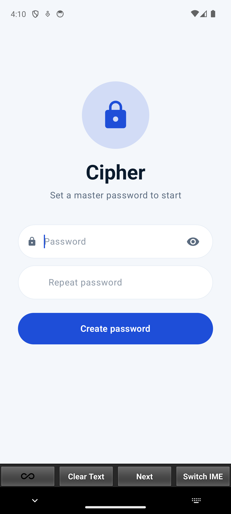
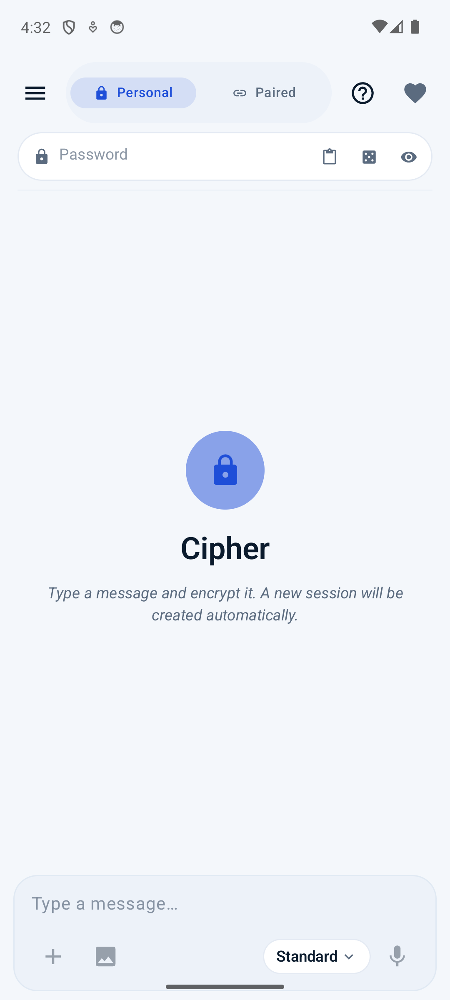
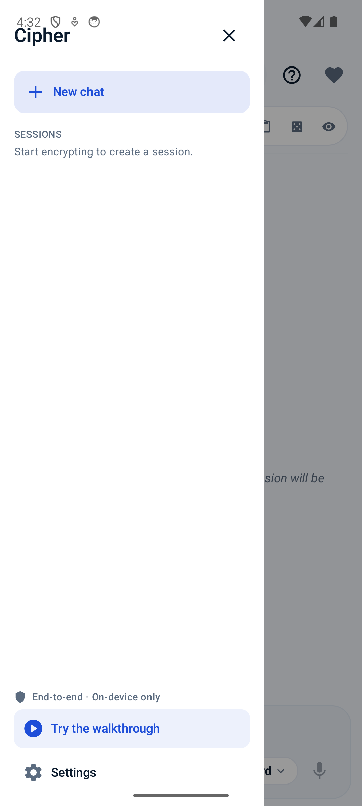
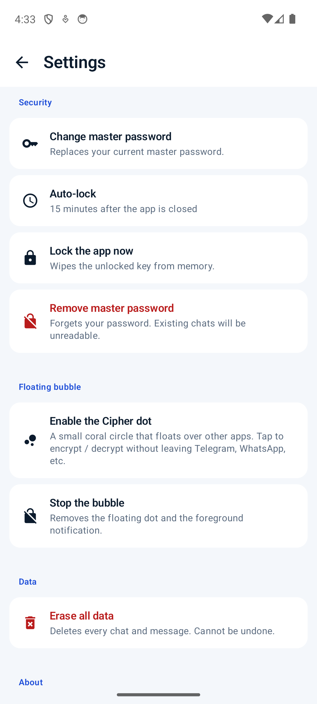

<div align="center">


# Cipher

**Offline, on-device encryption for messages that travel through other people's apps.**

Your plaintext never leaves the device. No account. No server. No telemetry.

[](LICENSE)
[](#install-the-pwa)
[](#install-on-android)
[](#security-model)
[](https://github.com/CMOS-Jumper/Cipher/stargazers)

<br />

<table>
<tr>
<td align="center" width="220">

<br /><sub><b>One master password</b></sub>
</td>
<td align="center" width="220">

<br /><sub><b>Encrypt in any chat</b></sub>
</td>
<td align="center" width="220">

<br /><sub><b>Sessions stay local</b></sub>
</td>
<td align="center" width="220">

<br /><sub><b>Settings + bubble</b></sub>
</td>
</tr>
</table>

</div>

---

## The idea

WhatsApp, Telegram, iMessage — the servers can read your messages any time they want.
Cipher fixes that **without asking you to switch apps**.

Type a message → encrypt it → paste the ciphertext into any messenger.
Your contact pastes it back into Cipher → reads the plaintext.
The messenger sees only random-looking text. Nothing sensitive ever touches a server.

**On Android**, a floating dot hovers over every app. Tap it, compose, copy the ciphertext,
paste into your chat — without ever leaving the conversation.

---

## Features

| | PWA | Android |
|---|:---:|:---:|
| AES-256-GCM encryption | ✅ | ✅ |
| PBKDF2-SHA256 key derivation (600k → 1M iterations) | ✅ | ✅ |
| Paired mode — ECDH P-256 per-chat key exchange | ✅ | ✅ |
| Share pairing code via QR, text, or camera scan | ✅ | ✅ |
| Voice messages — record, encrypt, play | ✅ | ✅ |
| Image steganography — hide text inside a PNG | ✅ | — |
| Audio steganography — hide text inside a WAV | ✅ | — |
| Emoji obfuscation mode | ✅ | ✅ |
| Persian-text disguise mode | ✅ | ✅ |
| QR-code output mode | ✅ | scan-only |
| Snow / noise visual modes | ✅ | ✅ |
| Master-password lifecycle (set / change / auto-lock) | — | ✅ |
| Fingerprint unlock (AndroidKeyStore) | — | ✅ |
| Floating bubble overlay | — | ✅ |
| One-tap screen scan (ML Kit QR + OCR) | — | ✅ |
| English + Persian UI | ✅ | ✅ |
| 17 color themes (Cobalt, Ivory, …) | ✅ | ✅ |
| Works fully offline | ✅ | ✅ |

---

## Install

### Install the PWA

1. Open **[cmos-jumper.github.io/Cipher](https://cmos-jumper.github.io/Cipher/)** in any modern browser
2. Click your browser's **Install** button — Chrome menu → *Install app*, or Safari share sheet → *Add to Home Screen*
3. Launch from your home screen. Works offline after first load.

### Install on Android

Download the latest APK from the [**Releases page**](https://github.com/CMOS-Jumper/Cipher/releases)
and side-load it on any device running Android 8.0 (API 26) or newer.

> **First-run checklist**
> 1. Set a master password — this is the only one you'll remember.
> 2. Choose language in **Settings → Language** (English or Persian).
> 3. Choose theme in **Settings → Appearance**.
> 4. Run the in-app tutorial: **Settings → Help & guide → Tutorials**.
> 5. Optional: enable fingerprint unlock in **Settings → Security**.
> 6. Optional: enable the floating bubble in **Settings → Floating bubble**.

The Android app declares **no INTERNET permission**. It cannot phone home.

---

## How it works

### Encryption

Every message is encrypted with **AES-256-GCM** using a key derived from your password via
**PBKDF2-SHA256** (600 000 iterations, random 16-byte salt). The output is a compact `CT4|`
envelope — type flag, base64 salt, base64 IV, base64 ciphertext — that survives copy-paste
through any messenger unchanged.

### Paired mode (ECDH)

Two users each generate a one-time **P-256 key pair**. They exchange only the public halves
(via text, QR code, or camera scan). Each device derives the same shared secret independently —
the private key never leaves the device and is deleted after use. All subsequent messages in
that chat are encrypted for the paired device only.

### Steganography (PWA)

After encryption Cipher can hide the `CT4|` envelope inside:

- **PNG images** — 2 LSBs of every R/G/B channel (6 bits/pixel, lossless)
- **WAV audio** — 1 LSB of every 16-bit PCM sample

The carrier file looks and sounds completely normal. Even if someone extracts the payload,
they still only see AES-256 ciphertext.

---

## Security model

| Concern | Mitigation |
|---|---|
| Password at rest | Never stored. PBKDF2-SHA256 verifier hash stored; chat secret AES-256-GCM wrapped. |
| Password change | Re-wraps the chat secret — no per-message re-encryption needed. |
| Timing side-channels | All unlock/set paths padded to ≥ 800 ms wall-clock. |
| Brute force | Exponential lockout after 3 misses, capped at 30 min. |
| Memory hygiene | `char[]` password arrays zeroed via `Arrays.fill` after every derivation. |
| Randomness | `crypto.getRandomValues` (PWA) / `SecureRandom` (Android) for IV, salt, chat secret. |
| Network | PWA: CSP `connect-src 'self'`. Android: no `INTERNET` permission in manifest. |
| Telemetry | None. No analytics, no crash reporter, no remote logging. |
| Biometric (Android) | AndroidKeyStore-backed AES-256-GCM key. Re-enrollment invalidates it. Master password always remains the source of truth. |

**Standard library crypto only** — nothing hand-rolled.

---

## Tech stack

| Layer | PWA | Android |
|---|---|---|
| Language | TypeScript 5.8 | Kotlin 2.0 |
| UI | React 19 + Tailwind CSS 4 | Jetpack Compose + Material 3 |
| Build | Vite 6 + vite-plugin-pwa | Gradle + AGP |
| Crypto | Web Crypto API (SubtleCrypto) | `javax.crypto` |
| Storage | IndexedDB | Room (SQLite) |
| DI | — | Hilt 2.52 |
| i18n | i18next | string resources |
| QR | qrcode + jsqr | ML Kit Barcode |

---

## Develop locally

```bash
git clone https://github.com/CMOS-Jumper/Cipher.git
cd Cipher
npm install
npm run dev        # → http://localhost:3000/
npm run build      # production bundle → dist/
npm run test       # Vitest suite (68 tests)
npm run lint       # tsc --noEmit
```

Requires Node 20+.

---

## Project layout

```
Cipher/
├── src/
│   ├── App.tsx            # main UI (~6 000 lines)
│   ├── components/        # GuidePanel, LanguageSwitcher, …
│   ├── lib/               # crypto, ecc, masterKey, db, steg, audio
│   ├── i18n/              # en.json, fa.json
│   └── tutorial/          # in-app walkthrough scenarios
├── public/                # PWA static assets + favicons
├── tests/                 # Vitest test suite
├── tools/codegen/         # generates Android shared assets from web modules
├── shared/                # test vectors (JSON)
├── assets/screenshots/    # README images
├── index.html
├── vite.config.ts
└── package.json
```

---

## Roadmap

- [ ] Persian obfuscation mode on Android
- [ ] Full Android i18n (string resources for all UI text)
- [ ] Real-device QA pass
- [ ] Wear OS companion (read encrypted messages on watch)
- [ ] File encryption on Android (PWA already has it)
- [ ] Compose Multiplatform — share `core` with an iOS port

---

## Contributing

PRs welcome.

- **Conventional Commits** (`feat:`, `fix:`, `chore:`, `refactor:`, `docs:`). First line ≤ 70 chars.
- **Squash on merge** to keep history linear.
- **No new runtime dependencies** unless they replace something larger or the feature would take > 50 LOC to reimplement.
- Open a **Discussion** before starting large features.

---

## License

[MIT](LICENSE) — use it, fork it, ship it.
